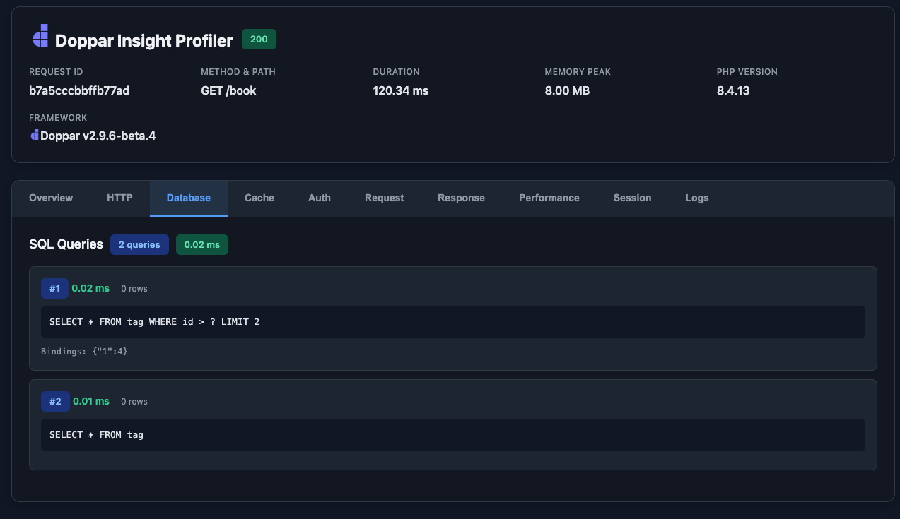
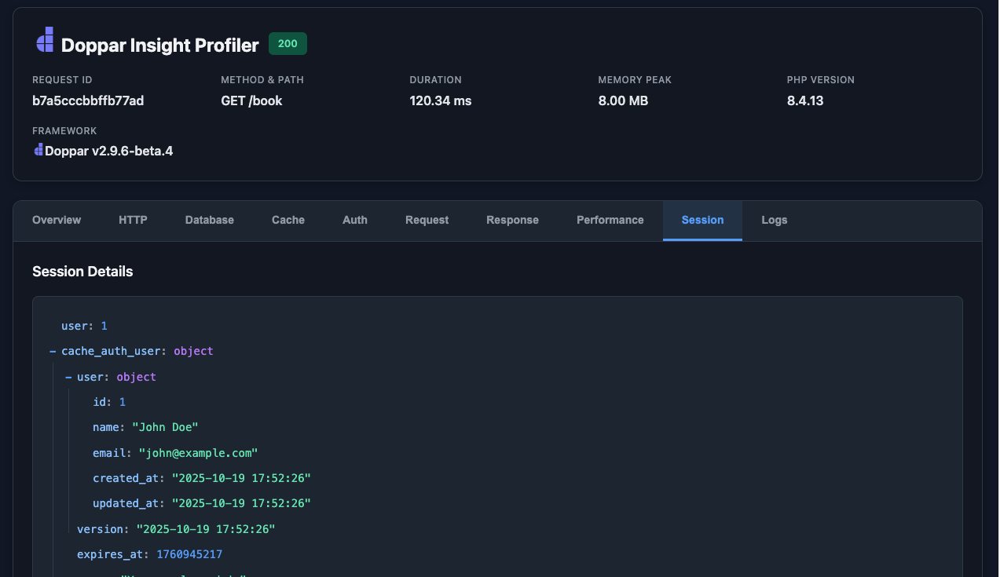
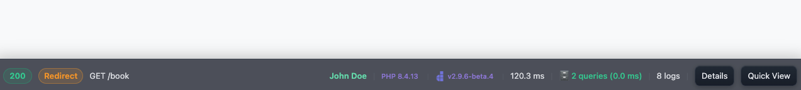

    

## About Doppar Insight
Doppar Insight Profiler is an advanced debugging and performance monitoring tool designed to give developers deep visibility into their application's inner workings. It provides detailed insights into every request, including HTTP methods, routes, response times, memory usage, and framework versions — all within a clean, intuitive dashboard.

## Screenshots

<table>
  <tr>
    <td width="50%">
      <h3 align="center">Queries</h3>
      
    </td>
    <td width="50%">
      <h3 align="center">Session</h3>
      
    </td>
  </tr>
  <tr>
    <td colspan="2">
      <h3 align="center">Main Toolbar</h3>
      
    </td>
  </tr>
</table>

### Production Notice
Do not use this package in production environments. This package is intended for development and testing purposes only. It provides diagnostic and analytical tools that may expose internal system details, which makes it unsuitable for production environments.

## Contributing

Thank you for considering contributing to the Doppar framework! The contribution guide can be found in the [Doppar documentation](https://doppar.com/versions/3.x/contributions.html).

## Code of Conduct

In order to ensure that the Doppar community is welcoming to all, please review and abide by the [Code of Conduct](https://doppar.com/versions/3.x/contributions.html#code-of-conduct).

## Security Vulnerabilities

Please review [our security policy](https://github.com/doppar/framework/security/policy) on how to report security vulnerabilities.

## License

The Doppar framework is open-sourced software licensed under the [MIT license](LICENSE.md).

