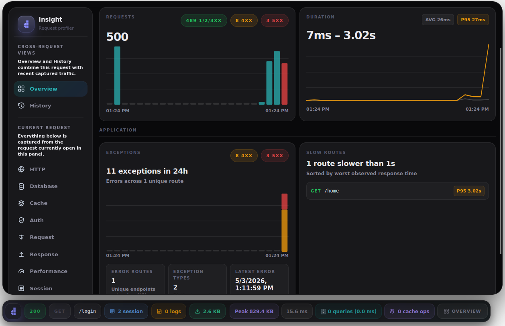
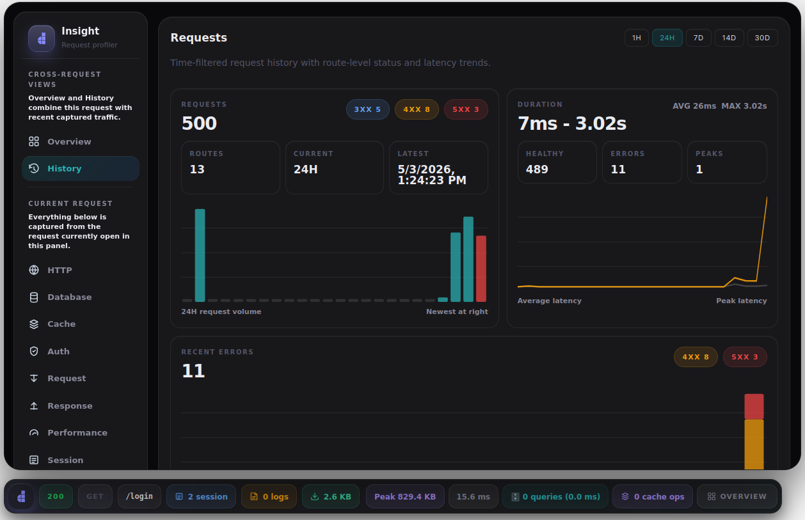
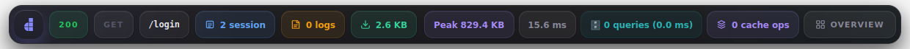
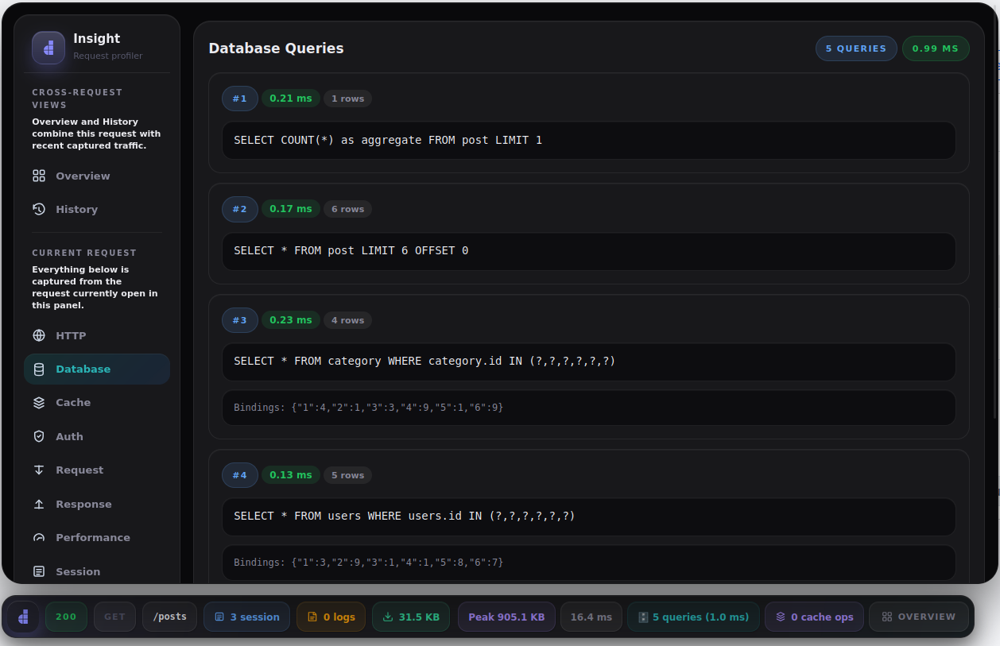
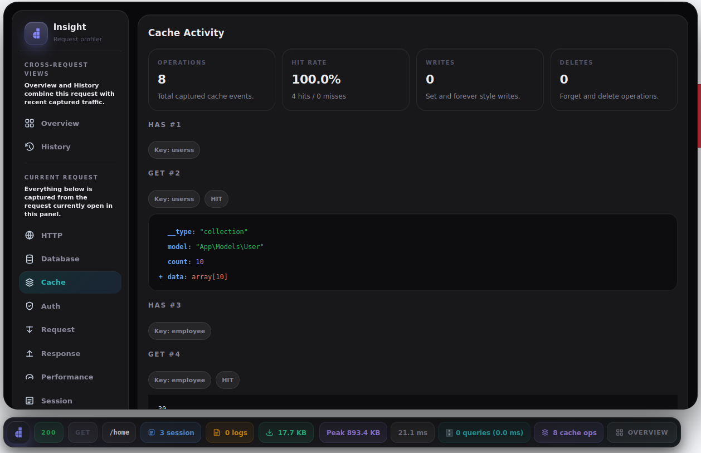
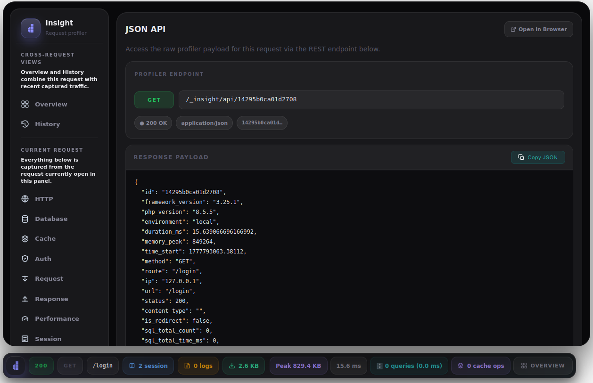

<p align="center">
    <a href="https://doppar.com" target="_blank">
        
    </a>
</p>
<p align="center">
<a href="https://github.com/doppar/insight/actions/workflows/tests.yml"></a>
<a href="https://packagist.org/packages/doppar/insight"></a>
<a href="https://packagist.org/packages/doppar/insight"></a>
<a href="https://github.com/doppar/insight/blob/main/LICENSE"></a>
</p>

## About Doppar Insight
Doppar Insight is a request profiler for debugging, performance analysis, and traffic inspection. It gives you a clean in-browser toolbar for the current request, and it also keeps a recent request history so you can compare status codes, response times, errors, and route activity across multiple requests.

Insight is useful when you want to inspect SQL queries, cache usage, authentication state, request and response payloads, session data, logs, or performance timing without leaving the page you are working on. It is designed for day-to-day development, but it is especially helpful when you need to trace slow endpoints or understand why a route is returning `4xx` or `5xx` responses.

## Screenshots

<table>
  <tr>
    <td width="50%">
      <h3 align="center">Overview Dashboard</h3>
      
    </td>
    <td width="50%">
      <h3 align="center">History Dashboard</h3>
      
    </td>
  </tr>
  <tr>
    <td width="50%">
      <h3 align="center">Toolbar</h3>
      
    </td>
    <td width="50%">
      <h3 align="center">Database Queries</h3>
      
    </td>
  </tr>
  <tr>
    <td width="50%">
      <h3 align="center">Cache Activity</h3>
      
    </td>
    <td width="50%">
      <h3 align="center">JSON API</h3>
      
    </td>
  </tr>
</table>

## Production Usage
Doppar Insight is primarily a development and diagnostics tool. It can capture sensitive request data, exception details, session state, logs, query information, and recent traffic history, so it should not be left enabled for normal public production traffic.

If you need to use Insight on a live server, treat it as a temporary internal debugging tool:

- keep it disabled by default
- enable it only for short troubleshooting windows
- restrict access to trusted internal or VPN IP addresses only
- avoid exposing the toolbar and history endpoints to public users

A safer production-style configuration looks like this:

```php
return [
    'enabled' => false,
    'allow_ips' => ['127.0.0.1', '::1'],
    'retention_days' => 1,
];
```

## Contributing

Thank you for considering contributing to the Doppar framework! The contribution guide can be found in the [Doppar documentation](https://doppar.com/versions/3.x/contributions).

## Code of Conduct

In order to ensure that the Doppar community is welcoming to all, please review and abide by the [Code of Conduct](https://doppar.com/versions/3.x/contributions#code-of-conduct).

## Security Vulnerabilities

Please review [our security policy](https://github.com/doppar/framework/security/policy) on how to report security vulnerabilities.

## License

The Doppar framework is open-sourced software licensed under the [MIT license](LICENSE.md).
